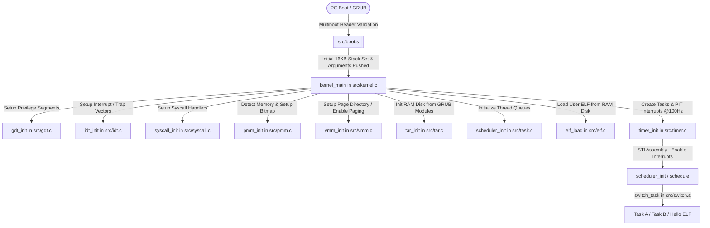

# 🪐 MyOS: Custom 32-bit x86 Operating System

A preemptive, multitasking, x86-32 Protected Mode operating system kernel built from scratch in C and Assembly. It features physical and virtual memory management (paging), demand paging, privilege separation (Ring 0 to Ring 3 transitions), dynamic ELF loading from a custom Virtual File System (VFS) backed by a TAR-based RAM disk, system call trapping, and preemptive Round-Robin scheduling via PIT timer interrupts.

---

## 🗺️ System Architecture

The lifecycle of MyOS, from boot to executing compiled ELF binaries in user space, follows this pipeline:



---

## 🧠 Core Subsystems & OSDEV Principles

### 1. Bootloader & Kernel Entry Point
* **OSDev Wiki Reference:** [Multiboot](https://wiki.osdev.org/Multiboot)
* **Underlying Principle:** x86 PCs boot in real mode (16-bit). Modern kernels require a bootloader (like GRUB) to load the kernel image into RAM, enable Protected Mode (32-bit), set up basic registers, and supply system information. MyOS conforms to the **Multiboot Specification v1**, establishing headers that allow GRUB to automatically discover the binary.
* **Code Walkthrough:**
  * [src/boot.s](file:///c:/Users/Timson%20Yap/My-Own-Operating-System/My-Own-Operating-System/src/boot.s) contains the Multiboot magic number (`0x1BADB002`) and flags.
  * The assembly label `_start` sets the stack pointer `ESP` to the top of a pre-allocated 16KB boot stack (`stack_top`), pushes the multiboot structure pointer (`EBX`) and magic number (`EAX`) onto the stack as arguments, and redirects execution to the C-level `kernel_main`.

---

### 2. Global Descriptor Table (GDT)
* **OSDev Wiki Reference:** [Global Descriptor Table](https://wiki.osdev.org/Global_Descriptor_Table)
* **Underlying Principle:** The GDT defines the memory segments (base addresses, limits, and access privileges) of the CPU. This is required on x86 to configure memory protection and segments for Ring 0 (Kernel) and Ring 3 (User Space).
* **Code Walkthrough:**
  * [src/gdt.h](file:///c:/Users/Timson%20Yap/My-Own-Operating-System/My-Own-Operating-System/src/gdt.h) defines `struct gdt_entry` (representing an 8-byte segment descriptor) and `struct gdt_ptr` (used by `lgdt` instruction).
  * [src/gdt.c](file:///c:/Users/Timson%20Yap/My-Own-Operating-System/My-Own-Operating-System/src/gdt.c) implements [gdt_init()](file:///c:/Users/Timson%20Yap/My-Own-Operating-System/My-Own-Operating-System/src/gdt.c#L80) which registers 6 segments covering the full 4GB address space:
    1. **Null Descriptor** (Index 0): Required by hardware.
    2. **Kernel Code** (Index 1, `0x08` offset): Present, Ring 0, Executable, Readable (`Access = 0x9A`).
    3. **Kernel Data** (Index 2, `0x10` offset): Present, Ring 0, Writable (`Access = 0x92`).
    4. **User Code** (Index 3, `0x18` offset): Present, Ring 3, Executable, Readable (`Access = 0xFA`).
    5. **User Data** (Index 4, `0x20` offset): Present, Ring 3, Writable (`Access = 0xF2`).
    6. **Task State Segment (TSS)** (Index 5, `0x28` offset): System segment holding kernel stack pointers (`Access = 0x89`).
  * [src/gdt_flush.s](file:///c:/Users/Timson%20Yap/My-Own-Operating-System/My-Own-Operating-System/src/gdt_flush.s) implements [gdt_flush()](file:///c:/Users/Timson%20Yap/My-Own-Operating-System/My-Own-Operating-System/src/gdt_flush.s#L15), which executes `lgdt` to load the table descriptor, reloads all data segment registers with `0x10`, and performs a far jump (`jmp 0x08:.flush`) to reload the Code Segment register (`CS`) with `0x08`.

---

### 3. Interrupt Descriptor Table (IDT) & ISR Handling
* **OSDev Wiki References:** [Interrupt Descriptor Table](https://wiki.osdev.org/Interrupt_Descriptor_Table), [Interrupts](https://wiki.osdev.org/Interrupts), [8259 PIC](https://wiki.osdev.org/8259_PIC)
* **Underlying Principle:** The IDT is a table of 256 gates mapping exceptions (divide-by-zero, page faults, etc.) and hardware IRQs to interrupt handlers. Hardware interrupts must be remapped via the PIC (Programmable Interrupt Controller) because their default PC vectors conflict with CPU exceptions (0–31).
* **Code Walkthrough:**
  * [src/idt.c](file:///c:/Users/Timson%20Yap/My-Own-Operating-System/My-Own-Operating-System/src/idt.c) implements [idt_init()](file:///c:/Users/Timson%20Yap/My-Own-Operating-System/My-Own-Operating-System/src/idt.c#L53) which registers exception stubs `isr0` to `isr31`, the System Call handler `isr128` (0x80 gate with Privilege level DPL=3, flag `0xEE`), and remapped PIC hardware interrupts `irq0` to `irq15` mapped to vectors 32–47.
  * [src/isr.s](file:///c:/Users/Timson%20Yap/My-Own-Operating-System/My-Own-Operating-System/src/isr.s) defines the raw assembly entry stubs. For exceptions that do not push an error code, the stub pushes a dummy `0` to unify stack layout. It pushes the interrupt number, executes `pusha` to dump all CPU registers, pushes the segment register `DS`, switches the segments to the kernel data selector (`0x10`), and calls the C function [isr_dispatch()](file:///c:/Users/Timson%20Yap/My-Own-Operating-System/My-Own-Operating-System/src/idt.c#L134) or [irq_dispatch()](file:///c:/Users/Timson%20Yap/My-Own-Operating-System/My-Own-Operating-System/src/idt.c#L168). It finishes by popping the registers (`popa`) and calling `iret`.

---

### 4. Task State Segment (TSS) & Privilege Separation
* **OSDev Wiki References:** [Task State Segment](https://wiki.osdev.org/Task_State_Segment), [Privilege Rings](https://wiki.osdev.org/Privilege_Rings)
* **Underlying Principle:** x86 implements hierarchical protection rings (Ring 0 is Kernel, Ring 3 is User). User space code runs in Ring 3 and is restricted from executing privileged instructions (e.g. `cli`, `hlt`, `in`, `out`) or accessing supervisor-protected memory. When a Ring 3 program triggers a syscall (`int 0x80`) or an interrupt, the CPU must switch privilege levels back to Ring 0. The CPU references the Task State Segment (TSS) to load the kernel stack segment (`SS0`) and stack pointer (`ESP0`) for safety.
* **Code Walkthrough:**
  * [src/gdt.c](file:///c:/Users/Timson%20Yap/My-Own-Operating-System/My-Own-Operating-System/src/gdt.c) sets up the `tss` struct and installs its GDT descriptor.
  * [src/gdt_flush.s](file:///c:/Users/Timson%20Yap/My-Own-Operating-System/My-Own-Operating-System/src/gdt_flush.s) loads the descriptor into the Task Register using `ltr ax` with value `0x2B` (`0x28` OR'ed with Ring 3 RPL to allow user space tasks to switch through it).
  * [src/user_switch.s](file:///c:/Users/Timson%20Yap/My-Own-Operating-System/My-Own-Operating-System/src/user_switch.s) implements [enter_user_mode()](file:///c:/Users/Timson%20Yap/My-Own-Operating-System/My-Own-Operating-System/src/user_switch.s#L24) which manually builds an interrupt return stack frame (pushing User SS, User ESP, EFLAGS with Interrupt Flag IF set, User CS, and EIP) and executes the `iret` instruction to drop privilege to Ring 3.
  * During task switching, the scheduler calls [tss_set_kernel_stack()](file:///c:/Users/Timson%20Yap/My-Own-Operating-System/My-Own-Operating-System/src/gdt.c#L101) to update the TSS with the active task's unique kernel stack top.

---

### 5. System Calls (Syscalls)
* **OSDev Wiki Reference:** [System Calls](https://wiki.osdev.org/System_Calls)
* **Underlying Principle:** A system call is the mechanism user programs use to request OS services. The program places the system call identifier in `EAX`, parameters in registers like `EBX`, `ECX`, and `EDX`, and executes a software interrupt (`int 0x80`). The CPU traps this, switches privilege to Ring 0, saves registers, routes the call to the kernel handler, modifies `EAX` on the stack to return a value, and returns to Ring 3.
* **Code Walkthrough:**
  * [src/syscall.c](file:///c:/Users/Timson%20Yap/My-Own-Operating-System/My-Own-Operating-System/src/syscall.c) registers [syscall_dispatch()](file:///c:/Users/Timson%20Yap/My-Own-Operating-System/My-Own-Operating-System/src/syscall.c#L56) on IDT vector 128 (0x80).
  * **Supported Syscalls:**
    * `SYSCALL_WRITE` (0): Writes characters to the VGA terminal. Reads string address from `ECX` and length from `EDX`.
    * `SYSCALL_EXIT` (1): Terminates the calling process by setting its state to `ZOMBIE` and scheduling the next ready task.

---

### 6. Physical Memory Manager (PMM)
* **OSDev Wiki Reference:** [Page Frame Allocator](https://wiki.osdev.org/Page_Frame_Allocator)
* **Underlying Principle:** The PMM tracks physical RAM in fixed-size blocks (4KB frames). It maps free versus reserved memory and ensures no two allocations overlap. MyOS utilizes a **Bitmap Allocator** where a single bit represents each physical page (0 = Free, 1 = Reserved).
* **Code Walkthrough:**
  * [src/pmm.c](file:///c:/Users/Timson%20Yap/My-Own-Operating-System/My-Own-Operating-System/src/pmm.c) implements [pmm_init()](file:///c:/Users/Timson%20Yap/My-Own-Operating-System/My-Own-Operating-System/src/pmm.c#L70), which parses the Multiboot memory map provided by GRUB to detect RAM size and free blocks.
  * The memory bitmap `pmm_bitmap` is placed directly at the end of the kernel (`_kernel_end` symbol).
  * Crucial memory zones (First 1MB for BIOS/VGA, Kernel binary code, the bitmap itself, and the RAM disk module) are reserved via [pmm_reserve_region()](file:///c:/Users/Timson%20Yap/My-Own-Operating-System/My-Own-Operating-System/src/pmm.c#L34).
  * [pmm_alloc_block()](file:///c:/Users/Timson%20Yap/My-Own-Operating-System/My-Own-Operating-System/src/pmm.c#L159) performs a first-fit scan over the bitmap words to find the first 0-bit, marks it 1, and returns its physical address. [pmm_free_block()](file:///c:/Users/Timson%20Yap/My-Own-Operating-System/My-Own-Operating-System/src/pmm.c#L184) frees the frame.

---

### 7. Virtual Memory Manager (VMM) & Paging
* **OSDev Wiki Reference:** [Paging](https://wiki.osdev.org/Paging)
* **Underlying Principle:** Paging maps virtual addresses to physical memory using a 2-level lookup scheme (Page Directory and Page Tables). This isolates kernel memory, protects programs from corrupting each other, and enables demand paging.
* **Architecture of x86-32 2-Level Paging:**
```
Virtual Address (32-bit):
+-------------------+-------------------+-----------------------+
|  Directory Index  |    Table Index    |      Page Offset      |
|    (10 bits)      |    (10 bits)      |       (12 bits)       |
+-------------------+-------------------+-----------------------+
        |                     |                     |
        v                     v                     v
 Page Directory          Page Table            Physical Frame
 [1024 Entries]        [1024 Entries]           (4KB Block)
```
* **Code Walkthrough:**
  * [src/vmm.c](file:///c:/Users/Timson%20Yap/My-Own-Operating-System/My-Own-Operating-System/src/vmm.c) initializes paging in [vmm_init()](file:///c:/Users/Timson%20Yap/My-Own-Operating-System/My-Own-Operating-System/src/vmm.c#L185) by allocating a Page Directory, flat identity-mapping all usable physical memory (with flags `Present | Read/Write | User`), loading the physical address of the Page Directory into the CPU control register `CR3`, and setting the paging enable (PG) bit 31 in `CR0`.
  * [vmm_map_page()](file:///c:/Users/Timson%20Yap/My-Own-Operating-System/My-Own-Operating-System/src/vmm.c#L40) parses the virtual address. If the required Page Table doesn't exist, it allocates a physical block on-the-fly, zeroes it, maps it in the Directory, and inserts the Page Table Entry (PTE). The Translation Lookaside Buffer (TLB) cache is invalidated for that virtual address using `invlpg`.
  * **Demand Paging:** [page_fault_handler()](file:///c:/Users/Timson%20Yap/My-Own-Operating-System/My-Own-Operating-System/src/vmm.c#L97) (registered on IDT Vector 14) reads the faulting virtual address from `CR2`. If a non-present page fault occurs in the test zone (`>= 0x1000` to `< 0xC0000000`), the handler dynamically allocates a physical frame, maps it virtual-to-physical, and returns. The CPU automatically re-executes the instruction that faulted, which now succeeds transparently.
  * **Privilege Violation:** If User Mode code attempts to write to a supervisor-only page (such as testing address `0xD0000000`), the VMM intercepts the exception, prints diagnostic info (EIP, CR2, Err Code), and halts with a **Kernel Panic**.

---

### 8. Preemptive Multitasking & Scheduler
* **OSDev Wiki Reference:** [Scheduling](https://wiki.osdev.org/Scheduling)
* **Underlying Principle:** Multitasking runs multiple tasks concurrently. Preemption interrupts running tasks to schedule another, ensuring fairness. Cooperative yielding can also be triggered.
* **Code Walkthrough:**
  * [src/task.h](file:///c:/Users/Timson%20Yap/My-Own-Operating-System/My-Own-Operating-System/src/task.h) defines `task_t` (storing PID, stack pointer `ESP`, page directory `CR3`, kernel stack top `kstack`, execution state, and queue pointer).
  * [src/task.c](file:///c:/Users/Timson%20Yap/My-Own-Operating-System/My-Own-Operating-System/src/task.c) sets up the scheduler. [task_create()](file:///c:/Users/Timson%20Yap/My-Own-Operating-System/My-Own-Operating-System/src/task.c#L77) allocates a kernel stack from PMM and constructs a fake call stack frame (with initial registers, return pointer to `task_kernel_bootstrap`, and target entry function).
  * [schedule()](file:///c:/Users/Timson%20Yap/My-Own-Operating-System/My-Own-Operating-System/src/task.c#L162) implements a Round-Robin algorithm to select the next `READY` task.
  * [src/switch.s](file:///c:/Users/Timson%20Yap/My-Own-Operating-System/My-Own-Operating-System/src/switch.s) implements [switch_task()](file:///c:/Users/Timson%20Yap/My-Own-Operating-System/My-Own-Operating-System/src/switch.s#L8):
    1. Pushes current task's caller-saved registers (`EBP`, `EBX`, `ESI`, `EDI`) onto its stack.
    2. Saves the stack pointer `ESP` in the current task struct.
    3. Restores `ESP` from the target task struct.
    4. Switches `CR3` page directories if the virtual address spaces differ.
    5. Calls `tss_set_kernel_stack` to update TSS so privilege-level switches map to the new task's kernel stack.
    6. Pops registers and returns (`ret`) into the target task's saved instruction path.
  * **Preemption Control:** The Programmable Interval Timer (PIT) configured in [src/timer.c](file:///c:/Users/Timson%20Yap/My-Own-Operating-System/My-Own-Operating-System/src/timer.c) triggers interrupt vector 32 at 100Hz. The timer handler calls `schedule()`, forcing task context switches every 10ms.

---

### 9. ELF Executable Loader
* **OSDev Wiki Reference:** [ELF](https://wiki.osdev.org/ELF)
* **Underlying Principle:** Compilers output binaries in ELF (Executable and Linkable Format). The loader parses these binaries, reads program headers, sets up virtual memory spaces, loads segments (`PT_LOAD`), and launches execution.
* **Code Walkthrough:**
  * [src/elf.c](file:///c:/Users/Timson%20Yap/My-Own-Operating-System/My-Own-Operating-System/src/elf.c) implements [elf_load()](file:///c:/Users/Timson%20Yap/My-Own-Operating-System/My-Own-Operating-System/src/elf.c#L24):
    1. Opens the ELF file from the VFS.
    2. Validates the ELF magic signature (`0x7F 'E' 'L' 'F'`), architecture (x86 32-bit), and type (executable).
    3. Allocates a new Page Directory `proc_pd` for the process, cloning the kernel space mappings.
    4. Parses program headers `Elf32_Phdr` for loadable segments (`PT_LOAD`).
    5. Disables interrupts briefly (`cli`), loads `proc_pd` into `CR3`, allocates physical blocks, maps them to the requested virtual addresses (`p_vaddr`) as user-accessible, zeroes them, and loads segment binary data from the file system.
    6. Restores the kernel page directory and returns the entry point (`e_entry`). If loading fails, it cleans up all allocated blocks to prevent leaks.
  * The scheduler creates a user task executing the ELF entry point with its virtual page directory.

---

### 10. Virtual File System (VFS) & TAR RAM Disk
* **OSDev Wiki References:** [Virtual File System](https://wiki.osdev.org/Virtual_File_System), [RAM Disk / USTAR](https://wiki.osdev.org/USTAR)
* **Underlying Principle:** A VFS abstracts filesystem operations. It maps a common set of file operations (`read`, `write`, `readdir`) to driver-specific functions. The RAM disk (initrd) packages system binaries inside a standard TAR archive loaded into memory by GRUB at boot time.
* **Code Walkthrough:**
  * [src/vfs.c](file:///c:/Users/Timson%20Yap/My-Own-Operating-System/My-Own-Operating-System/src/vfs.c) defines `fs_node_t` callback routers. It implements [find_node_by_path()](file:///c:/Users/Timson%20Yap/My-Own-Operating-System/My-Own-Operating-System/src/vfs.c#L46), parsing directory trees token by token (e.g. resolving `/hello` to `/` node and looking up `hello`).
  * [src/tar.c](file:///c:/Users/Timson%20Yap/My-Own-Operating-System/My-Own-Operating-System/src/tar.c) implements [tar_init()](file:///c:/Users/Timson%20Yap/My-Own-Operating-System/My-Own-Operating-System/src/tar.c#L121) which parses a USTAR tar archive loaded in physical RAM. It iterates through 512-byte headers, translates sizes, strips leading `./` file prefixes, creates file and directory nodes, and points node data pointers (`impl`) to the memory region immediately following the header blocks. The read calls map to `tar_read` which copies data from memory.

---

## 💾 Memory Layout

When MyOS is fully running with paging enabled, virtual memory is structured as follows:

| Virtual Address Range | Privilege Level | Description |
| :--- | :--- | :--- |
| `0x00000000` - `0x000FFFFF` | Ring 0 / Ring 3 | Real Mode / BIOS / VGA Text Buffer (`0xB8000`) |
| `0x00100000` - `_kernel_end` | Ring 0 / Ring 3 | Kernel Binary + Allocation Bitmap |
| `0x08048000` - Upwards | Ring 3 | Loaded ELF Program Segment space (e.g. `/hello`) |
| `0xBFFF0000` - `0xC0000000` | Ring 3 | User Space Task Stack (4KB frame allocated per task) |
| `0xC0000000` | Supervisor (Ring 0) | Demand paging test zone boundary |
| `0xD0000000` | Supervisor (Ring 0) | Supervisor-protected page (Access Violation triggers Panic) |

---

## 🛠️ Building & Running

### Prerequisites
To build the operating system, you need an x86 cross-compiler toolchain, NASM assembler, GRUB boot utilities, and QEMU emulator:
```bash
# Ubuntu/Debian host packages
sudo apt install build-essential bison flex libgmp3-dev libmpc-dev libmpfr-dev texinfo nasm qemu-system-x86 grub-pc-bin xorriso
```
*(Ensure `i686-elf-gcc` is available in your PATH)*

### Compilation
The build system is managed via the project [Makefile](file:///c:/Users/Timson%20Yap/My-Own-Operating-System/My-Own-Operating-System/Makefile). It compiles code, generates a test user space ELF program, packs it inside a TAR archive (`initrd.tar`), merges it into a GRUB ISO image structure, and outputs `myos.iso`.

```bash
# Clean previous builds
make clean

# Compile the kernel, initrd, and build the bootable ISO
make all
```

### Emulation
Run the compiled operating system ISO in QEMU:
```bash
make run
```
This runs QEMU with the operating system ISO loaded as a CD-ROM and registers the TAR archive as a multiboot initrd module:
`qemu-system-i386 -cdrom myos.iso -initrd initrd.tar`

---

## 🚀 Execution Flow & Tests In Action

Upon booting, the kernel executes several validation suites sequentially:

1. **PMM Diagnostics:** Allocates blocks, verifies alignments (4KB), frees blocks, and verifies reuse via first-fit logic.
2. **VMM Verification:**
   * **Test A:** Maps virtual address `0xA0000000` to a physical frame, writes `0xCAFEBABE`, verifies the read value, and unmaps it.
   * **Test B (Demand Paging):** Writes to unmapped address `0x40000000`. The Page Fault handler catches the exception, allocates a physical frame, maps it, and resumes execution seamlessly.
3. **Multitasking:** Creates two kernel-level Tasks (Task A and Task B) which execute in parallel using preemptive scheduler ticks at 100Hz.
4. **ELF Execution:** Loads `/hello` (compiled from [src/test_program.c](file:///c:/Users/Timson%20Yap/My-Own-Operating-System/My-Own-Operating-System/src/test_program.c)) from the RAM disk. It maps the program into a new process page directory, sets up a Ring 3 User Stack at `0xBFFF0000`, schedules the task, drops privilege to Ring 3, and runs it.
5. **Syscalls Trapping:** `/hello` issues `int 0x80` system calls to write its greeting to the console, and exits with code `5`.
6. **Supervisor Protection Test:** A Ring 3 task executes [user_program()](file:///c:/Users/Timson%20Yap/My-Own-Operating-System/My-Own-Operating-System/src/user_mode.c#L68) and attempts to write to the supervisor-only page at `0xD0000000`. The VMM captures the protection violation, outputs the register dump, and triggers a Kernel Panic, halting the CPU safely.
